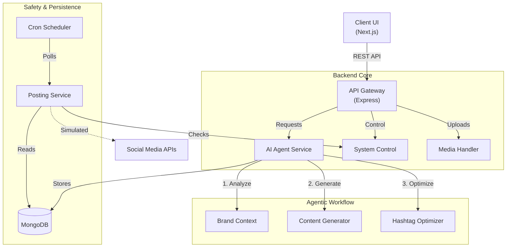

# Architecture & System Deliverables

## 1. Architecture Overview

High-level architecture demonstrating proper separation of concerns, agentic AI workflow, and safety controls.

### Key Components

1.  **AI Agent Service**: A multi-step reasoning engine (not a prompt wrapper). It analyzes brand voice, generates platform-specific content, and optimizes metadata in distinct steps.
2.  **State Machine**: Content moves through strict states (`PENDING` → `APPROVED` → `SCHEDULED` → `POSTED`). Transitions are hard-gated by the backend.
3.  **System Control**: A dedicated module that acts as a global kill-switch. It intercepts every posting attempt to verify the system is in `ACTIVE` mode.

---

## 2. Maintenance & Extension Plan

### How to Maintain

- **Monitoring**: The `AuditLog` collection tracks every action. Connect this to a dashboard (like MongoDB Charts) to monitor error rates and user activity.
- **Dependencies**: The system is built on standard `Node.js` and `React` patterns. Regular `npm update` is sufficient for maintenance.

### How to Modify / Extend

#### **Scenario A: Adding a New Platform (e.g., TikTok)**

1.  **Database**: Update `Platform` enum in `backend/src/models/index.ts` to include `'tiktok'`.
2.  **Frontend**: Add "TikTok" to the platform dropdown in `ApprovalQueueFilters.tsx`.
3.  **AI Service**: Add a specific specific prompt section for TikTok (short video scripts) in `aiAgent.service.ts`.
4.  **Posting Service**: Add a `mockPostToTikTok()` function in `posting.service.ts`.

#### **Scenario B: Swapping AI Models**

The system is model-agnostic. Currently using Anthropic Claude.

1.  Open `aiAgent.service.ts`.
2.  Modify the `generateText` helper to call OpenAI (GPT-4) or a generic LLM wrapper (LangChain) instead of the Anthropic SDK.
3.  The rest of the architecture (Approval Queue, Scheduler, Database) remains **100% unchanged**.

---

## 3. Admin Access & Configuration

The system is designed with a specific "System Control" layer for administrators.

### Configuration Model (`SystemControl`)

The database maintains a global configuration document that dictates behavior:

| Field                            | Type    | Description                                                                                  |
| :------------------------------- | :------ | :------------------------------------------------------------------------------------------- |
| `mode`                           | Enum    | `active`, `paused` (stops posting), `manual-only` (no auto-posting), `crisis` (full lockout) |
| `settings.autoPostingEnabled`    | Boolean | Global toggle for the cron job scheduler.                                                    |
| `settings.requireApprovalForAll` | Boolean | If true, even "trusted" users cannot auto-post.                                              |
| `settings.maxDailyPosts`         | Number  | Safety rate limit per brand.                                                                 |

### How to Configure (Simulated Admin)

1.  **UI Access**: Navigate to the **Settings** or **System Control** tab in the dashboard.
2.  **Mode Switching**:
    - **Pause**: Click "Pause System" to immediately halt all background jobs.
    - **Crisis**: Click "Crisis Mode" to reject all API calls and freeze the database.
3.  **Audit**: All configuration changes are logged in `AuditLog` with the admin's ID and timestamp.

**Authentication Note**: In a production environment, this route (`/api/system/*`) would be protected by a specific `admin` role middleware (RBAC), which is currently mocked via the generated user ID.
